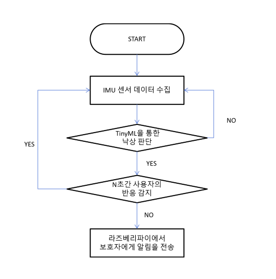

# Tiny Vision Cane - Fall Detection

시각장애인 보행 보조 지팡이 환경을 가정하여, **사용자 낙상 후 위급 상황**과 **지팡이 낙하 또는 사용자 단순 낙상**을 구분하여 동작하는 임베디드 AI 시스템 프로젝트이다.

## 목차
- [프로젝트 개요](#프로젝트-개요)
- [하드웨어 구성](#하드웨어-구성)
- [데이터 흐름](#데이터-흐름)
- [프로젝트 구조](#프로젝트-구조)
- [Edge Impulse 워크플로](#edge-impulse-워크플로)
- [AI 명세](#ai-명세)
  - [1) 데이터 수집](#1-데이터-수집-data-collection)
  - [2) 데이터 전처리](#2-데이터-전처리-data-preprocessing)
  - [3) 학습 및 추론](#3-학습-및-추론-training--inference)
  - [4) 배포 및 후속 동작](#4-배포-및-후속-동작-deployment--action)
- [모델 파일 관리](#모델-파일-관리)
- [참고 자료](#참고-자료)

## 프로젝트 개요
- IMU 센서값을 바탕으로 Edge Impulse를 이용해 학습 모델을 생성한다.
- MCU에서 실시간 IMU 가속도 데이터를 수집하고, TinyML을 이용해 IMU 센서값을 바탕으로 추론한다.
- 낙상/낙하 이벤트로 판단되면 부저를 울리고,
- 낙상 후 지팡이를 다시 드는 행위가 감지되면 사용자 안전 또는 지팡이 단순 낙하로 판단한다.
- 낙상 후 일정 시간 동안 지팡이를 들지 못하면 위급 상황으로 판단해 보호자 알림을 수행한다.

## 하드웨어 구성
- **MCU**: XIAO ESP32-S3
- **IMU 모듈**: ADA-4634 (Adafruit 9-DOF LSM9DS1 Breakout Board)
- **IMU 센서**: LSM9DS1
- **프로젝트 I2C 배선**: SDA `GPIO5`, SCL `GPIO6`
  - 이 핀 번호는 LSM9DS1 센서와 ESP32-S3 보드를 연결한 프로젝트 배선 및 펌웨어 설정이다.
- **I2C 버스 설정**: `100kHz`
  - LSM9DS1 데이터시트는 I2C standard mode `100kHz`와 fast mode `400kHz`를 지원하고, 현재 펌웨어는 안정성을 우선해 `100kHz`로 설정한다.
- **가속도계 설정**: `CTRL_REG6_XL = 0x60`
  - LSM9DS1 데이터시트 기준 `ODR_XL=011`은 `119Hz`, `FS_XL=00`은 `+-2g`이다.
  - 즉, 현재 코드의 가속도계 설정은 데이터시트의 레지스터 정의에 기반한다.
- **I2C 프로토콜**: `0x6A` or `0x6B` 주소 후보에 기반해 감지되는 것을 사용한다.
  - constexpr uint8_t kLsm9ds1AgAddrCandidates[] = {0x6A, 0x6B};

## 데이터 흐름


## 프로젝트 구조
- `main/edge_impulse_data_forwarder_main.cc`: Edge Impulse 데이터 수집용 CSV 스트리밍 펌웨어
- `main/Fall_detection.cc`: TFLM 추론, 낙상 후 상태 판단, 부저/알림 제어 로직
- `main/accelerometer_handler.cpp`: LSM9DS1 I2C 초기화 및 6축 IMU(가속도, 자이로) 수집
- `main/model_input_provider.cc`: 모델 입력 텐서에 맞춰 IMU 슬라이딩 윈도우 구성
- `models/fall_model.cc`: 변환된 TFLite 모델 배열 파일
- `models/archive/`: 이전 `.tflite` 모델 보관 위치
- `tools/convert_tflite_to_cc.py`: `models/*.tflite`를 `models/fall_model.cc`로 변환하는 스크립트

## Edge Impulse 워크플로
Edge Impulse의 forwarder 펌웨어를 사용해 데이터를 수집하고 학습시킨 뒤 추론을 진행한다.

1. 기본 CMake 옵션은 `FALL_DETECTION_EDGE_IMPULSE_DATA_FORWARDER=ON`이다.
2. 이 모드에서는 ESP32-S3가 IMU 6축 값을 `accel_x,accel_y,accel_z,gyro_x,gyro_y,gyro_z` CSV 한 줄로 계속 출력한다.
3. 출력 주기는 25Hz이다.
4. Edge Impulse Data Forwarder에서 시리얼 포트를 연결해 데이터를 수집한다.
5. Edge Impulse에서 impulse, feature, classifier를 구성하고 `.tflite` 모델을 다운로드한다.
6. 다운로드한 `.tflite`를 `models/`에 넣고 `tools/convert_tflite_to_cc.py`로 C 배열 파일을 생성한다.
7. 추론 펌웨어에서는 `FALL_DETECTION_EDGE_IMPULSE_DATA_FORWARDER=OFF`로 전환 후 추론을 돌린다.

권장 라벨 순서:

- `normal`: 평상시 보행/일상 움직임
- `event`: 부저를 울리고 후처리 감시를 시작해야 하는 낙상/낙하 이벤트

`Fall_detection.cc`의 모델 출력은 `[normal, event]` 2클래스를 기준으로 한다. `safe`와 `danger`는 Edge Impulse 학습 라벨이 아니라 펌웨어 후처리 결과다. 모델이 `event`를 감지하면 부저를 울리고, 이후 10초 동안 지팡이를 다시 드는지 감시한다. 다시 들면 안전 처리하고, 들지 못하면 위급 상황으로 판단해 보호자 알림을 수행한다.

## AI 명세

### 1) 데이터 수집 (Data Collection)
학습에는 자체 수집 데이터를 사용한다. 공개 낙상 데이터셋은 클래스 설계와 패턴 이해를 위한 참고 자료로만 활용했다.

- 참고 데이터셋
  - Walker Fall Detection: 보행 보조기 기반 움직임과 낙하 패턴 참고
  - KFall Dataset: 인체 전도 시 발생하는 충격과 가속도 패턴 참고
- 자체 수집 데이터
  - `normal`: 지팡이 보행, 계단 이용, 점자 블록 탐색 등 일상 움직임
  - `event`: 지팡이 낙하, 사용자 낙상 순간, 낙상 후 지팡이를 다시 드는 움직임 등 부저 후 pickup 감시가 필요한 상황

### 2) 데이터 전처리 (Data Preprocessing)
Magic_Wand의 MCU 데이터 수집 흐름을 참고하여, 현재 Tiny Vision Cane 펌웨어는 LSM9DS1 가속도 3축과 자이로 3축을 모델 입력으로 사용한다.

- 입력 데이터: `accel_x,accel_y,accel_z,gyro_x,gyro_y,gyro_z` 6축 IMU 값
- 입력 윈도우(Sliding Window): 모델 입력 텐서 길이에 맞춰 최근 샘플을 유지
- 스케일: 센서 raw 값을 `g` 단위로 변환
- 버퍼 방식: 오래된 샘플을 제거하고 새 샘플을 뒤에 넣는 슬라이딩 윈도우
- 양자화 모델 지원: 모델 입력이 `int8` 또는 `uint8`이면 텐서 quantization 파라미터에 맞춰 변환

### 3) 학습 및 배포 (Training & Deployment)
Edge Impulse에서 학습한 TFLite 모델을 `models/fall_model.cc`로 변환해 ESP32-S3 펌웨어에 포함한다.

- 모델 출력은 2클래스 기준이다.
  - `normal`: 평상 상태
  - `event`: 낙상/낙하 이벤트 후보
- `safe`와 `danger`는 모델 출력이 아니라 펌웨어 후처리 결과다.
- Edge Impulse에서 impulse, feature, classifier를 구성하고 `.tflite` 모델을 다운로드한다.
- 다운로드한 `.tflite`를 `models/`에 넣고 `tools/convert_tflite_to_cc.py`로 C 배열 파일을 생성하여 배포한다.

### 4) 추론 및 후속 동작 (Inference & Action)

- 모델이 `event`를 감지하면 부저를 울리고 10초 pickup 감시를 시작한다.
- pickup은 모델 라벨이 아니라 펌웨어 후처리 판정이다. 의미는 "사용자가 손으로 잡았다"를 직접 인식한다는 뜻이 아니라, event 이후 지팡이가 다시 다뤄지고 있다고 볼 만큼 큰 가속도 변화가 있었다는 뜻이다.
- pickup 판정은 현재 가속도 3축만 사용한다. 샘플의 가속도 벡터를 `a(t) = (x, y, z)`라고 할 때 다음 값을 계산한다.
  - `delta_g = sqrt((x(t)-x(t-1))^2 + (y(t)-y(t-1))^2 + (z(t)-z(t-1))^2)`
  - `magnitude_g = sqrt(x(t)^2 + y(t)^2 + z(t)^2)`
- event 직후 `1.5초` 동안은 충격 잔여 움직임을 무시한다. 그 이후 10초 안에 아래 조건 중 하나라도 만족하면 pickup으로 판단하고 알림을 취소한다.
  - `delta_g >= 0.30g`: 이전 샘플 대비 방향이나 움직임이 충분히 바뀐 경우
  - `magnitude_g >= 1.35g`: 들어 올림, 강한 흔들림, 충격처럼 순간 가속도 크기가 충분히 큰 경우
- 10초 동안 pickup 조건을 만족하지 못하면 지팡이를 다시 들지 못한 것으로 보고 위급 상황으로 판단해 보호자 알림을 수행한다.
- ESP32-S3 추론 결과를 바탕으로 지팡이 내 부저와 보호자 알림을 수행한다.
- 통신 아키텍처
  - **ESP32-S3 (Master)**: 실시간 센싱 + TFLM 추론 + 이벤트 판단
  - **Raspberry Pi 또는 외부 Sentry**: 추후 보호자 알림 전송 경로로 연동
- 최종 알림
  - 보호자에게 App Push/SMS 전송
  - 지팡이 부저 또는 음성 안내로 주변 도움 요청

## 모델 파일 관리
1. Edge Impulse에서 `.tflite` 모델을 다운로드한다.
2. 새 모델을 `models/` 폴더에 넣습니다.
3. 기존 `.tflite`가 있다면 `models/archive/`로 직접 옮긴다.
4. 변환 스크립트를 실행합니다.

```powershell
python tools/convert_tflite_to_cc.py
```

`models/`에 `.tflite`가 여러 개 있으면 파일명을 직접 지정한다.

```powershell
python tools/convert_tflite_to_cc.py fall_model_v1.tflite
```

스크립트는 기존 `models/fall_model.cc`를 백업하지 않고 새 모델 기준으로 덮어씁니다. `.tflite` 백업은 `models/archive/`에서 직접 관리합니다.

추론 펌웨어 전환 예시:

```powershell
idf.py -DFALL_DETECTION_EDGE_IMPULSE_DATA_FORWARDER=OFF reconfigure build flash monitor
```

TFLITE op가 바뀌었을 경우, main을 수정해주어야 한다.

## 참고 자료
- Walker Fall Detection: https://www.kaggle.com/datasets/antonygarciag/walker-fall-detection/data
- KFall Dataset
- LSM9DS1 Datasheet: https://www.st.com/resource/en/datasheet/lsm9ds1.pdf
